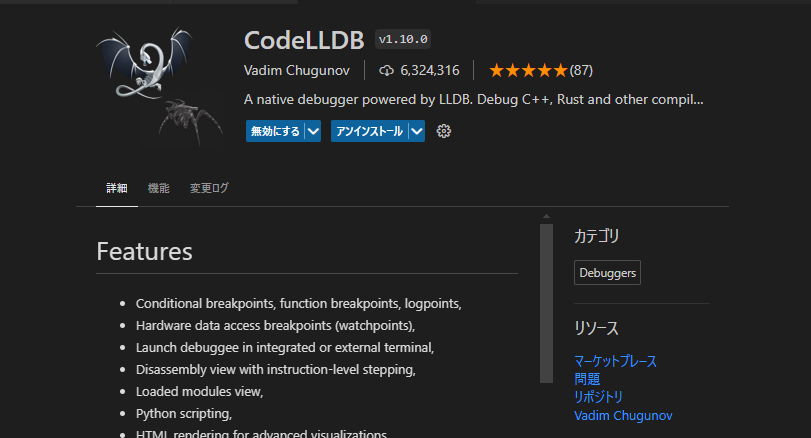
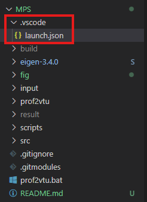
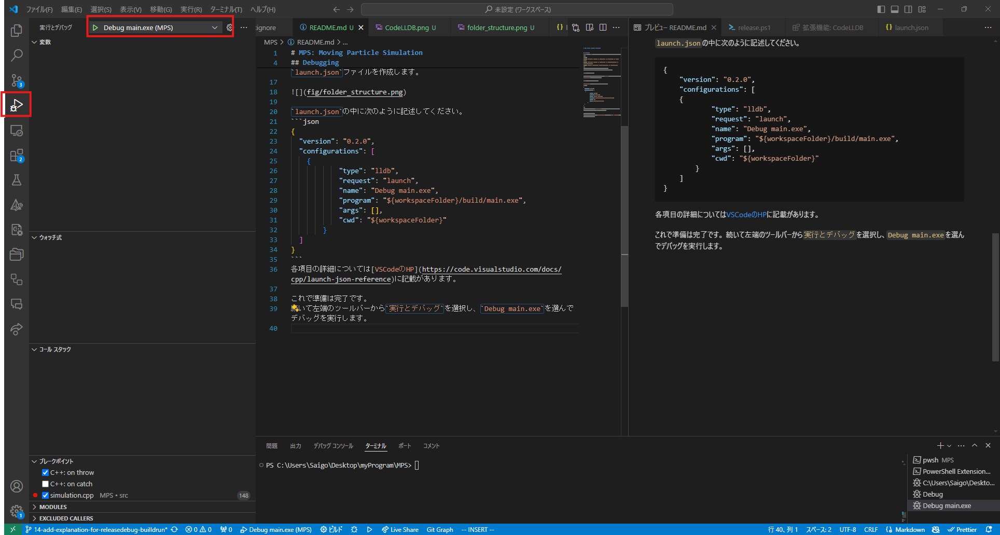
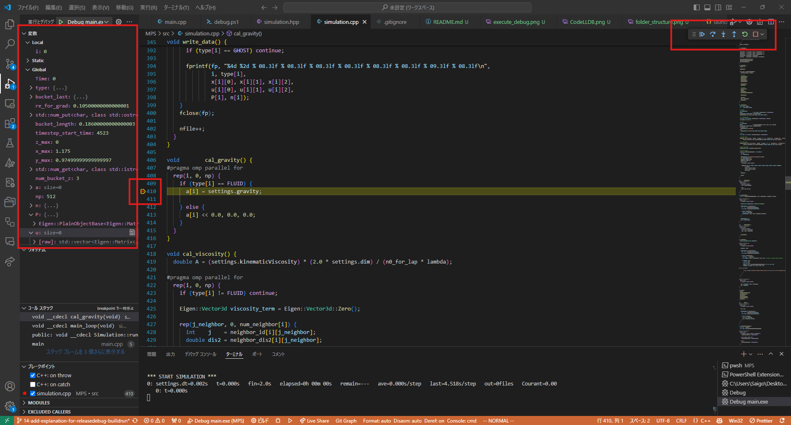

# MPS: Moving Particle Simulation


## Debugging
`clang`の場合`-g`オプションでデバッグ可能です。次のようにしてコンパイルします。
```bash
clang++ -std=c++17 -g -I eigen-3.4.0 -c src/main.cpp -o build/main.o
clang++ -std=c++17 -g -I eigen-3.4.0 -c src/simulation.cpp -o build/simulation.o
clang++ -g build/main.o build/simulation.o -o build/main.exe
```
実行にはVSCodeのデバッグ機能を使うのが便利です。
下準備としてCodeLLDBという拡張機能をインストールします。



続いてこのプロジェクトフォルダの最上層に`.vscode`フォルダを作成し、その中に`launch.json`ファイルを作成します。



`launch.json`の中に次のように記述してください。
```json
{
	"version": "0.2.0",
	"configurations": [
    {
            "type": "lldb",
            "request": "launch",
            "name": "Debug main.exe",
            "program": "${workspaceFolder}/build/main.exe",
            "args": [],
            "cwd": "${workspaceFolder}"
        }
	]
}
```
各項目の詳細については[VSCodeのHP](https://code.visualstudio.com/docs/cpp/launch-json-reference)に記載があります。

これで準備は完了です。
続いて左端のツールバーから`実行とデバッグ`を選択し、`Debug main.exe`を選んでデバッグを実行します。



これでデバッグが開始します。
次のようにコードのある行にブレークポイントを設置すればその行で実行が止まり、変数の中身を確認したり一行ずつ実行したりすることが可能です。

